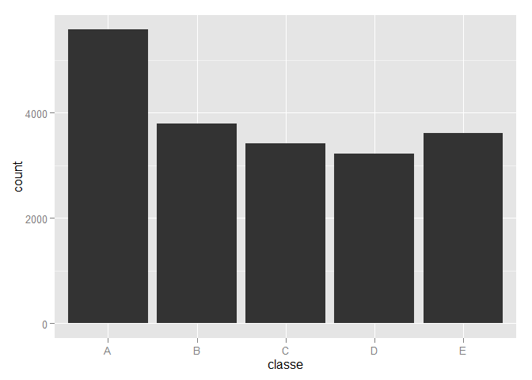
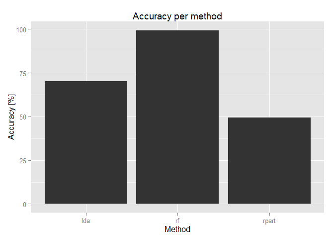

# Practical Machine Learning Coursera Project
Maciej Nowak  
Monday, October 24, 2015  
## Executive summary
The goal of this research is to predict the way individuals perform the unilateral dumbbell biceps curl. It is based on the "Weight Lifting Exercises" (http://groupware.les.inf.puc-rio.br/har). In the following sections I perform exploratory data analyses then decide on the model and finally use the model to predict the *classe* (the exercise quality) on the provided test data set. I believe that my final model is right as indicated in the below sections and because I scored 100% on the prediction assignment submission. 

## Exploratory data analyses
I loaded the training data set and as the data set consisted of 160 columns, many of them empty or with invalid/useless values I ran the following code to retrieve promising columns:

```r
rm(list = ls()) # clean the environment so the results are reproducible
# load all needed packages
library(ggplot2, quietly = TRUE)
library(caret, quietly = TRUE)
library(rpart, quietly = TRUE)
library(MASS, quietly = TRUE)
library(randomForest, quietly = TRUE)
```

```
## randomForest 4.6-12
## Type rfNews() to see new features/changes/bug fixes.
```

```r
flist <- dir(path = ".", pattern = "^pml.*training.csv$", ignore.case = TRUE, include.dirs = FALSE)
inputSet <- read.csv(flist[ 1 ])
inputSetCols <- names(inputSet)
promisingColumns <- c()
for(i in 2:ncol(inputSet)) # the first column is a row number
{
    if(length(which(is.na(as.character(as.vector(inputSet[ , i ]))) == TRUE )) > 0)
    {
        next # NA/missing values in the column
    }
    else if(length(which(nchar(as.vector(inputSet[ , i ])) == 0)) > 0)
    {
        next # empty fields in this column
    }

    promisingColumns <- c(promisingColumns, inputSetCols[ i ])
}
```

I decided to remove *user_name*, *raw_timestamp_part_1*, *raw_timestamp_part_2*, *cvtd_timestamp* as in this research the prediction should not be dependent on an individual name or her/his exercise time, it should be universal, at least it is how I understand this task. The same applies to *new_window*, *num_window*. So after the selection I got a list of columns considered as predictors:


```r
consideredColumns <- c(
    # equipment attached to the belt
    #
    "roll_belt", "pitch_belt", "yaw_belt", "total_accel_belt",
    "gyros_belt_x", "gyros_belt_y", "gyros_belt_z",
    "accel_belt_x", "accel_belt_y", "accel_belt_z",
    "magnet_belt_x", "magnet_belt_y", "magnet_belt_z",
    
    # equipment attached to the arm
    #
    "roll_arm", "pitch_arm","yaw_arm", "total_accel_arm",
    "gyros_arm_x", "gyros_arm_y", "gyros_arm_z",
    "accel_arm_x", "accel_arm_y", "accel_arm_z",
    "magnet_arm_x", "magnet_arm_y", "magnet_arm_z",
    
    # equipment attached to the dumbbell
    #
    "roll_dumbbell", "pitch_dumbbell", "yaw_dumbbell", "total_accel_dumbbell",
    "gyros_dumbbell_x", "gyros_dumbbell_y", "gyros_dumbbell_z",
    "accel_dumbbell_x", "accel_dumbbell_y", "accel_dumbbell_z",
    "magnet_dumbbell_x", "magnet_dumbbell_y", "magnet_dumbbell_z",
    
    # equipment attached to the forearm
    #
    "roll_forearm", "pitch_forearm", "yaw_forearm", "total_accel_forearm",
    "gyros_forearm_x", "gyros_forearm_y", "gyros_forearm_z",
    "accel_forearm_x", "accel_forearm_y", "accel_forearm_z",
    "magnet_forearm_x", "magnet_forearm_y", "magnet_forearm_z")
```
The columns correspond to four testing points (the points the equipment had been attached to):   
- arm  
- forearm   
- belt  
- dumbbell   
  
I also noticed the samples were relatively evenly spread, there was slightly higher count for *classe*="A" but I decided to consider all records.

```r
g <- ggplot(data = inputSet) + geom_histogram(aes(x = classe))
g
```

 

## Modeling, cross validation and out of sample error
Then I created *consideredSet* data.frame only with the columns I found useful.

```r
consideredSet <- inputSet[ , c(consideredColumns, "classe") ] # the final data set
rm(inputSet, flist) # release the memory
```
For my cross validation I used sub sampling, I went through *roundsNumber* iterations. I selected three models:  
 - rpart - Recursive Partitioning and Regression Trees  
 - lda - Linear Discriminant Analysis  
 - rf - Random Forest  
As far as the out of sample error is concerned as the outcome is discrete (non-continuous), non-numeric data I decided to calculate "accuracy" - percentage of correctly predicted values for the test data set.  

```r
roundsNumber <- 3 # the number of train & test rounds - this low number is due to low computing power of my 8 years old Windows Vista laptop
trainPercent <- 0.6 # percentage of data going to the training bucket
methods <- c("rpart", "lda", "rf") # the methods we want to verify
myAccuracy <- data.frame(stringsAsFactors = FALSE) # this data.frame accumulates the cross validation results

for(round in 1:roundsNumber)
{
    # create the training and testing data sets which we will use for each method
    #
    set.seed(9310432)
    idx = createDataPartition(y = consideredSet$classe, p = trainPercent, list = FALSE)
    trainSet <- consideredSet[ idx, ] 
    testSet <- consideredSet[ -idx, ]
    expectedRes <- as.vector(testSet[ , c("classe") ])
    
    # run modeling for each method on the same data set
    #
    for(m in 1:length(methods))
    {
        set.seed(85931)
        
        f <- switch(methods[ m ],
                    "rpart" = train(classe ~ ., method ="rpart", data = trainSet),
                    "lda" = train(classe ~ ., method ="lda", data = trainSet),
                    "rf" = randomForest(classe ~ ., data = trainSet)
        )
        testRes <- as.vector(predict(f, newdata = testSet))
        res <- testRes == expectedRes
        accuracy <- 100 * length(which(res == TRUE)) / length(res)
        myAccuracy <- data.frame(rbind(myAccuracy,
                                       data.frame(list(Method = methods[ m ], 
                                                       Round = round, 
                                                       Accuracy = accuracy), stringsAsFactors = FALSE)))
    }
}

finalRes <- aggregate(Accuracy ~ Method, data = myAccuracy, FUN = mean) # calculate the average accuracy
finalRes # print the results
```

```
##   Method Accuracy
## 1    lda 70.13765
## 2     rf 99.31175
## 3  rpart 49.45195
```

```r
g <- ggplot(data = finalRes, aes(x = Method, y = Accuracy)) + 
     geom_bar(stat="identity") +
     ylab("Accuracy [%]") +
     labs(title = "Accuracy per method")
g # plot the results
```

 
    
The table and the plot above clearly indicate that the best fit is the random forest (rf) model.

## Test cases prediction
For the final prediction on the provided test set I split *consideredSet* with 60% records in train data set. That way I avoid overfitting and still supply enough data to build a good model fit.

```r
idx = createDataPartition(y = consideredSet$classe, p = trainPercent, list = FALSE)
trainSet <- consideredSet[ idx, ] 
testSet <- consideredSet[ -idx, ]
f <- randomForest(classe ~ ., data = trainSet)

# now read the testing data set, predict and write the results to the files
#
flist <- dir(path = ".", pattern = "^pml.*testing.csv$", ignore.case = TRUE, include.dirs = FALSE)
inputSet <- read.csv(flist[ 1 ]);
predictSet <- inputSet[ , c(consideredColumns, "problem_id") ]
rm(inputSet, flist)

for(i in 1:nrow(predictSet))
{
    r <- as.vector(predict(f, newdata = predictSet[ predictSet$problem_id == i, ]))
    filename <- paste0("problem_id_",i,".txt")
    write.table(r[ 1 ], file = filename, quote = FALSE, row.names = FALSE, col.names = FALSE)
}
```
